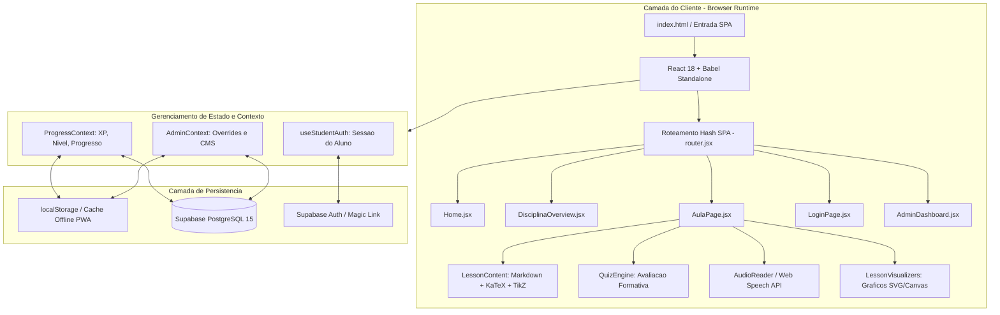

# Brasil Finanças Atlas (BFA)

> Plataforma educacional aberta e de alta densidade técnica dedicada ao ensino rigoroso de matemática aplicada, finanças quantitativas, análise fundamentalista, valuation e preparação para olimpíadas econômicas (BRHSIC / IEO).
> Projeto desenvolvido no âmbito do Núcleo de Inteligência Financeira (NIF).

---

## 1. Visão Geral e Arquitetura do Sistema

O Brasil Finanças Atlas adota uma arquitetura Single Page Application (SPA) orientada a padrões abertos da Web, eliminando pipelines pesados de compilação em tempo de build para permitir execução universal, manutenção simplificada e carregamento instantâneo em qualquer navegador moderno.



---

## 2. Links Oficiais e Ambientes

| Ambiente | Provedor / Tecnologia | URL de Acesso | Propósito |
| :--- | :--- | :--- | :--- |
| **Produção Principal** | Cloudflare Pages / Edge Network | [https://atlas-c2i.pages.dev/](https://atlas-c2i.pages.dev/) | Plataforma interativa completa com quizzes, simuladores e sincronização |
| **Documentação Técnica** | GitHub Pages / MkDocs | [https://brasil-financas-atlas.github.io/bfa/](https://brasil-financas-atlas.github.io/bfa/) | Ementa editorial, manuais e notas de apoio estáticas |
| **Ambiente Local** | Python HTTP Server | `http://127.0.0.1:3333/` | Servidor local com recarregamento e auto-sincronização ativa |

---

## 3. Engenharia e Funcionamento dos Subsistemas

### 3.1 Pipeline de Transpilação e Renderização Client-Side
- **Runtime sem Bundler:** A aplicação executa componentes JSX diretamente no navegador através do Babel Standalone (`@babel/standalone`), eliminando etapas intermediárias de empacotamento com Webpack ou Vite.
- **Isolamento de Erros:** Um manipulador global de exceções captura falhas de execução e renderiza diagnósticos técnicos formatados, prevenindo telas brancas silenciosas.
- **Roteamento Hash Seguro:** Utiliza navegação baseada em Hash (`#/matematica/modulo-1/aula-01`), garantindo compatibilidade com provedores estáticos sem necessidade de reescritas de URL no servidor.

### 3.2 Motor de Renderização Matemática e Textual (`LessonContent.jsx`)
- **Fórmulas Matemáticas com KaTeX:** Processamento de LaTeX inline (`$...$`) e em bloco (`$$...$$`) com aceleração de renderização via DOM.
- **Caixas de Destaque Pedagógicas (Admonitions):** Suporte a blocos customizados de sintaxe `:::dica`, `:::atencao`, `:::exemplo`, `:::conceito-chave` e `:::aprofundamento`.
- **Higienização DOMPurify:** Todo o HTML gerado a partir do Markdown passa por filtragem estrita contra ataques XSS antes da injeção no DOM.
- **Diagramas Vetoriais em TikZ:** Suporte a compilação de diagramas TeX/TikZ em tempo de execução via WebAssembly (TikzJax) com cache SHA-256 local.

### 3.3 Motor de Avaliação Formativa (`QuizEngine.jsx`)
- **Estrutura por Questão:** Cada pergunta contém enunciado com KaTeX, alternativas randomizadas, justificativa detalhada para a alternativa correta e explicação dos distratores.
- **Controle de Tentativas e Penalidade Gradual:** O sistema concede pontuação cheia (100 XP) no primeiro acerto e calcula deduções controladas em tentativas subsequentes.
- **Persistência Imediata:** As respostas e o status de aprovação em cada aula são sincronizados no contexto do usuário e salvos tanto em `localStorage` quanto no Supabase.

### 3.4 Motor de Áudio e Acessibilidade (`AudioReader.jsx` / `FloatingAudioBar.jsx`)
- **Síntese de Voz Nativa:** Integração direta com a Web Speech API (`SpeechSynthesisUtterance`) com seleção automática de vozes em Português Brasileiro (`pt-BR`).
- **Segmentação e Highlighting:** O texto da aula é tokenizado em parágrafos e frases; durante a reprodução, o parágrafo corrente recebe realce visual dinâmico.
- **Barra de Reprodução Flutuante Global:** Permite ao estudante pausar, retroceder, avançar e alterar a velocidade da narração (0.75x a 2.0x) mantendo o áudio ativo enquanto navega pelo conteúdo.

### 3.5 Sistema de CMS In-Context e Overrides (`AdminPages.jsx` / `EditableBlock.jsx`)
- **Edição em Tempo Real:** Usuários administradores autenticados podem editar textos, títulos e blocos de exercícios diretamente na interface das aulas.
- **Modelo de Sobrescrita Não-Destrutivo:** As alterações criam uma camada de *overrides* em JSON sem modificar os dados estáticos base (`matematicaData.js`, `financasData.js`).
- **Publicação Unificada:** Os overrides podem ser persistidos na tabela `cms_overrides` do Supabase ou exportados para o arquivo `overrides.json`.

### 3.6 Camada de Autenticação e Sincronização em Nuvem (`useStudentAuth.js` / `schema.sql`)
- **Modo Anônimo / Offline:** O estudante pode utilizar a plataforma sem cadastro; o progresso, notas e conquistas são gerenciados no `localStorage`.
- **Login Sem Senha (Magic Link) ou Email/Senha:** Integração com Supabase Auth.
- **Sincronização Bidirecional Debounced:** Ao autenticar, o progresso local é mesclado com a nuvem através de chamadas com *debounce* de 3 segundos para evitar requisições redundantes.
- **Segurança com Row-Level Security (RLS):** Políticas estritas no PostgreSQL garantem que cada usuário só possa ler e atualizar seus próprios dados de progresso e submissões.

---

## 4. Estrutura de Diretórios do Repositório

```
brasil-financas-atlas/
├── index.html                           # Entrada da aplicacao SPA (Babel Standalone + React 18 + KaTeX)
├── 404.html                             # Fallback para roteamento estatico
├── manifest.json                        # Manifesto PWA para instalacao em dispositivos moveis
├── sw.js                                # Service Worker para cache e operacao offline
├── netlify.toml                         # Configuracao de headers e seguranca para edge deploy
├── mkdocs.yml                           # Configuracao da documentacao editorial MkDocs
├── requirements.txt                     # Dependencias Python para documentacao e build
├── auto_sync.py                         # Daemon de sincronizacao automatica com GitHub
│
├── src/                                 # Codigo-fonte principal da aplicacao React
│   ├── main.jsx                         # Inicializador do ReactDOM e provedores globais
│   ├── App.jsx                          # Roteador principal e gerenciador de layout
│   ├── router.jsx                       # Hook e utilitarios de navegacao Hash SPA
│   │
│   ├── components/                      # Componentes modulares de interface
│   │   ├── NavbarFooter.jsx             # Barra de navegacao responsiva, menu mobile e rodape
│   │   ├── BottomNavBar.jsx             # Barra de navegacao rapida para dispositivos moveis
│   │   ├── LessonContent.jsx            # Parser Markdown, KaTeX, TikZ e caixas admonitions
│   │   ├── QuizEngine.jsx               # Motor de avaliacao formativa com feedback passo a passo
│   │   ├── AudioReader.jsx              # Sintetizador de voz com Web Speech API e highlighting
│   │   ├── FloatingAudioBar.jsx         # Player persistente de reproducao de audio
│   │   ├── EditableBlock.jsx            # Bloco de edicao in-context para administradores
│   │   ├── BadgesConquistas.jsx         # Grade e calculo de medalhas e conquistas
│   │   ├── RankingLeaderboard.jsx       # Tabela de classificacao e gamificacao de XP
│   │   ├── SimuladosEngine.jsx          # Motor de provas e simulados cronometrados
│   │   ├── Icons.jsx                    # Biblioteca de icones vetoriais SVG (sem emojis)
│   │   ├── ThemeSelector.jsx            # Alternador de paletas de cores (Verde, Dourado, Grafite)
│   │   └── CookieConsent.jsx            # Notificacao e gerenciamento de consentimento LGPD
│   │
│   ├── pages/                           # Telas principais da plataforma
│   │   ├── Home.jsx                     # Pagina inicial, trilhas de estudo e metricas
│   │   ├── DisciplinaOverview.jsx       # Grade curricular dos modulos de Matematica e Financas
│   │   ├── AulaPage.jsx                 # Tela imersiva de aula, leitor, audio e quiz integrado
│   │   ├── LoginPage.jsx                # Interface unificada de login de alunos e administradores
│   │   ├── AdminPages.jsx               # Painel administrativo, gestao de alunos e CMS
│   │   └── ExtraPages.jsx               # Paginas auxiliares (Sobre, BRHSIC, Noticias)
│   │
│   ├── context/                         # Contextos globais do React
│   │   ├── ProgressContext.jsx          # Gestao de progresso, XP, badges e persistencia
│   │   └── AdminContext.jsx             # Gestao de permissoes e overrides de conteudo
│   │
│   ├── data/                            # Conteudo pedagogico estruturado e esquemas de dados
│   │   ├── matematicaData.js            # 4 modulos com 29 aulas de matematica aplicada
│   │   ├── financasData.js              # 3 modulos com 26 aulas de financas corporativas
│   │   ├── brhsicData.js                # Guia olimpico BRHSIC / Equity Research
│   │   ├── simuladosData.js             # Banco de questoes para simulados olimpicos
│   │   ├── schema.sql                   # Esquema relacional PostgreSQL com tabelas e RLS
│   │   └── overrides.json               # Camada de personalizacao e sobrescritas do CMS
│   │
│   ├── styles/                          # Arquitetura modular de estilos CSS
│   │   ├── globals.css                  # Reset, variaveis CSS, tipografia e design tokens
│   │   ├── typography.css               # Escalas de fontes, classes mono e formatacao KaTeX
│   │   ├── components.css               # Estilos de cards, botoes, modais e badges
│   │   ├── animations.css               # Micro-interacoes e transicoes fluidas
│   │   ├── themes.css                   # Temas visuais (Claro, Escuro, Grafite, Ouro)
│   │   └── admin.css                    # Estilos especificos para painel de administracao
│   │
│   └── utils/                           # Modulos auxiliares
│       ├── supabaseClient.js            # Cliente de conexao com Supabase SDK
│       ├── useStudentAuth.js            # Hook de autenticacao e sincronizacao de perfil
│       ├── helpers.js                   # Formatadores de moeda, porcentagem, datas e hashes
│       └── env.js                       # Leitor centralizado de configuracoes de ambiente
│
├── docs/                                # Documentacao tecnica, ementas e propostas
│   ├── proposta_editor_colaboradores_tikz_png.md  # Especificacao de editor rico TikZ e imagens
│   ├── seguranca_e_login_supabase.md              # Documento de seguranca e arquitetura de auth
│   └── matematica-aplicada-a-financas/            # Arquivos base de aulas em Markdown
└── scratch/                             # Scripts de teste e validacao de sintaxe Babel
```

---

## 5. Matriz Curricular

### Trilha 1: Matemática Aplicada a Finanças (29 Aulas)
1. **Módulo 1 — Álgebra do Zero (7 Aulas):** Operações aritméticas fundamentais, frações, porcentagem, regra de três, potenciação, radiciação, notação científica e equações de 1º grau.
2. **Módulo 2 — Matemática Financeira Aplicada (5 Aulas):** Variação percentual, juros simples e compostos, inflação, cálculo de juros reais pelo modelo de Fisher, rentabilidade líquida e equivalência CDI vs Selic.
3. **Módulo 3 — Funções, Progressões e Probabilidade (9 Aulas):** Funções afins e exponenciais, logaritmos, progressões aritméticas (SAC), progressões geométricas (Tabela Price), somatório, produtório e valor esperado.
4. **Módulo 4 — Estatística e Regressão Linear (8 Aulas):** Estatística descritiva, médias ponderadas, medidas de dispersão (variância e desvio padrão), coeficiente de variação, Z-Score, covariância, matriz de correlação e regressão linear simples por Mínimos Quadrados Ordinários (MQO).

### Trilha 2: Finanças Corporativas e Análise Fundamentalista (26 Aulas)
1. **Módulo 1 — Fundamentos do Sistema Financeiro Nacional (9 Aulas):** Estrutura do SFN (CMN, Bacen, CVM), títulos públicos do Tesouro Direto, renda fixa privada (CDB, LCI, LCA, Debêntures), mercado de capitais e ações, fundos imobiliários (FIIs) e indicadores macroeconômicos (PIB, Câmbio, Balança Comercial).
2. **Módulo 2 — Análise Fundamentalista de Empresas (9 Aulas):** Balanço Patrimonial, estrutura da Demonstração do Resultado do Exercício (DRE), Demonstração do Fluxo de Caixa (DFC), indicadores de rentabilidade (ROE, ROIC, Margem Líquida), indicadores de endividamento e liquidez, múltiplos de mercado (P/L, EV/EBITDA, P/VP) e avaliação por Fluxo de Caixa Descontado (FCD / WACC).
3. **Módulo 3 — Montagem de Carteiras e Gestão de Risco (8 Aulas):** Teoria Moderna do Portfólio (Markowitz), classes de ativos, diversificação e descorrelação, alocação estratégica de capital, métricas de volatilidade e VaR (Value at Risk), estratégias de rebalanceamento por bandas e planejamento tributário.

### Trilha 3: Preparação BRHSIC (Brazilian High School Investment Competition)
- Metodologia de Equity Research, estruturação de relatórios de tese de investimento, modelagem de cenários e defesa perante banca avaliadora.

---

## 6. Como Executar Localmente

### Pré-requisitos:
- Python 3.10 ou superior (para servidor HTTP e auto-sync).
- Node.js 18 ou superior (apenas para testes automatizados com Babel).

### Execução do Servidor:
1. Clone o repositório e acerte o diretório de trabalho:
   ```bash
   git clone https://github.com/brasil-financas-atlas/atlas.git
   cd atlas
   ```
2. Inicie o servidor local:
   ```bash
   python -m http.server 3333
   ```
3. Abra seu navegador em `http://127.0.0.1:3333`.

### Validação de Compilação dos Arquivos JSX:
Para testar a sintaxe de todos os 81 componentes JSX via Babel Standalone:
```bash
node scratch/test_babel.js
```

---

## 7. Configuração de Variáveis de Ambiente e Supabase

Para habilitar a autenticação de estudantes e a persistência na nuvem, configure as chaves públicas em `src/utils/env.js` ou nas variáveis de ambiente do provedor de deploy:

```javascript
window.ENV = {
  VITE_SUPABASE_URL: "https://seu-projeto.supabase.co",
  VITE_SUPABASE_ANON_KEY: "sua-chave-anon-publica"
};
```

O esquema de tabelas SQL e as políticas de segurança RLS necessárias estão documentados em `src/data/schema.sql`.

---

## 8. Diretrizes de Qualidade e Contribuição

1. **Proibição Estrita de Emojis:** Ícones e representações gráficas devem obrigatoriamente utilizar componentes SVG vetoriais do módulo `src/components/Icons.jsx` (`BfaIcon`).
2. **Acessibilidade e Semântica:** Todas as tabelas matemáticas utilizam tags HTML nativas (`table`, `thead`, `tbody`, `th`, `td`) estilizadas para contraste e legibilidade.
3. **Compatibilidade com Dispositivos:** Testar layouts tanto em resoluções Desktop widescreen quanto em visões móveis com a barra `BottomNavBar.jsx`.

---

## 9. Licença

Este projeto é distribuído sob licença aberta com finalidade estritamente educacional, sem fins lucrativos, visando à democratização do conhecimento em ciências exatas e finanças para estudantes brasileiros.
