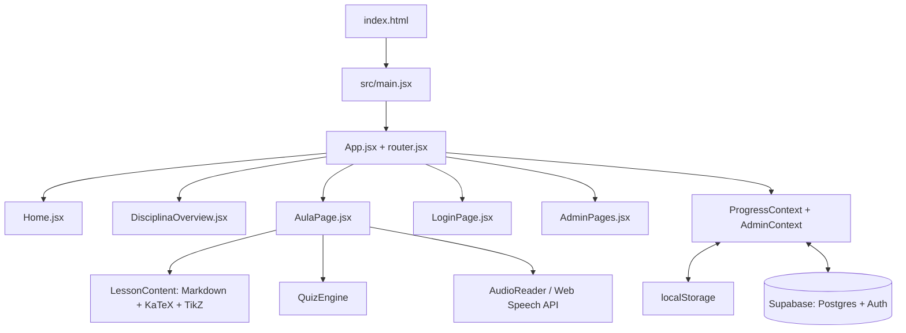

# Brasil Finanças Atlas (BFA) — BRHSIC Academy

**Um site gratuito para aprender matemática financeira, mercado de capitais e se preparar para a olimpíada de investimentos BRHSIC.**

Qualquer pessoa pode estudar, sem pagar nada e sem precisar criar conta. Quem cria uma conta (só com o e-mail) tem o progresso salvo na nuvem e pode continuar de qualquer aparelho.

Projeto desenvolvido no âmbito do Núcleo de Inteligência Financeira (NIF).

---

## Sumário

1. [Acessar o site](#1-acessar-o-site)
2. [O que tem para estudar](#2-o-que-tem-para-estudar)
3. [Como usar o site (para alunos)](#3-como-usar-o-site-para-alunos)
4. [Como o repositório está organizado](#4-como-o-repositório-está-organizado)
5. [Onde mudar cada coisa](#5-onde-mudar-cada-coisa)
6. [Rodar o site no seu computador](#6-rodar-o-site-no-seu-computador)
7. [Glossário rápido](#7-glossário-rápido)
8. [Detalhes técnicos (para desenvolvedores)](#8-detalhes-técnicos-para-desenvolvedores)
9. [Regras do projeto](#9-regras-do-projeto)
10. [Licença](#10-licença)

---

## 1. Acessar o site

| O quê | Endereço | Para que serve |
| :--- | :--- | :--- |
| **Site principal** | [atlas-c2i.pages.dev](https://atlas-c2i.pages.dev/) | A plataforma completa: aulas, exercícios, quizzes e conta de aluno |
| **Documentação** | [brasil-financas-atlas.github.io/bfa](https://brasil-financas-atlas.github.io/bfa/) | Ementas e textos de apoio em formato de leitura |
| **No seu computador** | `http://localhost:3000` | Só para quem vai editar o código (ver [seção 6](#6-rodar-o-site-no-seu-computador)) |

O site funciona no computador, no tablet e no celular, em pé ou deitado. Também pode ser "instalado" no celular como um aplicativo: no navegador, use a opção **Adicionar à tela inicial**.

---

## 2. O que tem para estudar

São **55 aulas** divididas em três trilhas:

**Trilha 1 — Matemática Aplicada a Finanças (29 aulas)**
- Módulo 1 — Álgebra do Zero: contas básicas, frações, porcentagem, regra de três, potências e equações.
- Módulo 2 — Matemática Financeira: juros simples e compostos, inflação, juros reais, CDI e Selic.
- Módulo 3 — Funções, Progressões e Probabilidade: funções, logaritmos, tabelas SAC e Price, valor esperado.
- Módulo 4 — Estatística e Regressão: média, desvio padrão, correlação e regressão linear.

**Trilha 2 — Finanças e Mercado (26 aulas)**
- Módulo 1 — Sistema Financeiro Nacional: Banco Central, CVM, Tesouro Direto, CDB, LCI, ações, fundos imobiliários.
- Módulo 2 — Análise de Empresas: balanço, DRE, fluxo de caixa, indicadores (ROE, P/L, EV/EBITDA) e valuation.
- Módulo 3 — Carteiras e Risco: diversificação, Markowitz, volatilidade, VaR e rebalanceamento.

**Trilha 3 — Preparação BRHSIC**
- Como fazer uma análise de empresa (Equity Research), montar a tese de investimento e apresentar para a banca.

Cada aula tem texto com fórmulas, leitura em voz alta (áudio), exercícios com correção explicada e fórum.

---

## 3. Como usar o site (para alunos)

O topo do site foi pensado para ter **poucos botões**:

| No topo | O que faz |
| :--- | :--- |
| **Logo** | Volta para a página inicial |
| **Matemática · Finanças · BRHSIC · Exercícios** | Atalhos para as trilhas (em telas pequenas ficam dentro do menu) |
| **Lupa** | Abre a busca de aulas. Atalho no teclado: tecla `/` ou `Ctrl + K` |
| **Entrar** | Cria a conta ou entra com o e-mail. Depois de entrar, vira um círculo com a sua inicial |
| **Menu (três linhas)** | Todo o resto: trilhas, exercícios, conquistas, Sobre, Notícias, Portal BRHSIC, modo escuro e Área do Professor |

Dicas:
- **Sem conta**, o progresso fica salvo só naquele navegador.
- **Com conta**, você recebe um código no e-mail (não precisa de senha) e o progresso fica salvo na nuvem.
- A tecla `Esc` fecha a busca e o menu.

---

## 4. Como o repositório está organizado

"Repositório" é a pasta com todos os arquivos do projeto. Na raiz ficam só os arquivos importantes:

```
atlas/
├── README.md            Este guia
├── AGENTS.md            Regras para assistentes de IA que trabalham no projeto
├── index.html           Página de entrada do site
├── package.json         Lista de bibliotecas que o site usa (React, KaTeX, Supabase...)
├── vite.config.js       Configuração da ferramenta que monta o site (Vite)
├── auto_sync.py         Sincroniza automaticamente o PC local com o GitHub
│
├── src/                 O CÓDIGO DO SITE (é aqui que quase tudo acontece)
│   ├── pages/           Uma página do site por arquivo (inicial, aula, login, admin...)
│   ├── components/      Peças reutilizáveis (cabeçalho, quiz, leitor de áudio, ícones...)
│   ├── data/            O CONTEÚDO: textos das aulas, exercícios, notícias
│   ├── styles/          Cores, fontes e layout (CSS)
│   ├── context/         "Memória" do site: progresso do aluno e modo administrador
│   └── utils/           Funções auxiliares (conexão com o banco, login, formatação)
│
├── public/              Arquivos copiados como estão (ícone, manifesto do app, service worker)
├── docs/                Textos da documentação pública (site MkDocs)
├── docs-internos/       Manuais internos que NÃO vão para o site público
├── supabase/patches/    Comandos SQL avulsos já aplicados no banco de dados
├── scripts/manutencao/  Scripts de correção usados uma única vez (histórico)
└── plataforma/          Versão antiga do site (sem Vite), ainda publicada pelo netlify.toml
```

Arquivos de configuração de publicação: `netlify.toml`, `_redirects`, `404.html`, `sw.js`, `manifest.json` e `mkdocs.yml`.

---

## 5. Onde mudar cada coisa

| Quero mudar... | Arquivo |
| :--- | :--- |
| Texto ou exercício de uma aula de Matemática | `src/data/matematicaData.js` |
| Texto ou exercício de uma aula de Finanças | `src/data/financasData.js` |
| Conteúdo da trilha BRHSIC | `src/data/brhsicData.js` |
| Notícias | `src/data/noticiasData.js` |
| Página "Sobre" | `src/data/sobreData.js` e `src/pages/ExtraPages.jsx` |
| Página inicial | `src/pages/Home.jsx` |
| Cabeçalho, menu lateral e rodapé | `src/components/NavbarFooter.jsx` |
| Cores e fontes | `src/styles/globals.css` e `src/styles/themes.css` |
| Layout no celular e no tablet | Fim de `src/styles/components.css` (seção "Cabecalho compacto + layout responsivo") |
| Ícones | `src/components/Icons.jsx` |
| Estrutura do banco de dados | `src/data/schema.sql` |

Administradores também podem editar textos direto no site, sem mexer em código. Essas edições ficam salvas no banco de dados (Supabase) ou em `src/data/overrides.json`.

---

## 6. Rodar o site no seu computador

Só é necessário para quem vai mexer no código.

**Você vai precisar de:**
- [Node.js](https://nodejs.org/) versão 18 ou mais nova (instale a versão "LTS").
- [Git](https://git-scm.com/) para baixar o projeto.

**Passo a passo:**

1. Baixe o projeto e entre na pasta:
   ```bash
   git clone https://github.com/brasil-financas-atlas/atlas.git
   cd atlas
   ```
2. Instale as bibliotecas (só na primeira vez, ou quando o `package.json` mudar):
   ```bash
   npm install
   ```
3. Ligue o site em modo de desenvolvimento:
   ```bash
   npm run dev
   ```
   O navegador abre sozinho em `http://localhost:3000`. Toda alteração salva aparece na hora.
4. Para gerar a versão final, a mesma que vai para o ar:
   ```bash
   npm run build
   ```
   O resultado fica na pasta `dist/`.

**Sincronização automática com o GitHub (opcional):** o `auto_sync.py` envia e recebe alterações sozinho. Ele precisa de um arquivo `.env` com `GITHUB_PAT=...`, um token do GitHub com as permissões `repo` e `workflow`. Para ligar, rode `python auto_sync.py`.

---

## 7. Glossário rápido

| Termo | Significado |
| :--- | :--- |
| **Repositório** | A pasta do projeto guardada no GitHub, com o histórico de todas as alterações |
| **Commit** | Um "ponto de salvamento" com uma descrição do que mudou |
| **Branch** | Uma cópia paralela do projeto, para testar mudanças sem afetar o site no ar |
| **Deploy** | Publicar uma nova versão do site na internet |
| **React** | Biblioteca usada para montar as telas do site |
| **Vite** | Ferramenta que junta os arquivos de `src/` e gera o site final |
| **Supabase** | Serviço de banco de dados e login usado para salvar o progresso dos alunos |
| **KaTeX** | Biblioteca que desenha fórmulas matemáticas |
| **PWA** | Site que pode ser instalado no celular como um aplicativo |

---

## 8. Detalhes técnicos (para desenvolvedores)

<details>
<summary>Arquitetura</summary>

Aplicação de página única (SPA) em React 18, empacotada com Vite. A navegação usa rotas com `#` (ex.: `#/matematica/modulo-1/aula-01`), o que permite hospedar em qualquer serviço de arquivos estáticos.



</details>

<details>
<summary>Subsistemas</summary>

- **Conteúdo (`LessonContent.jsx`)**: Markdown com fórmulas KaTeX (`$...$` e `$$...$$`), caixas pedagógicas (`:::dica`, `:::atencao`, `:::exemplo`, `:::conceito-chave`, `:::aprofundamento`), HTML higienizado com DOMPurify e diagramas TikZ.
- **Quizzes (`QuizEngine.jsx`)**: alternativas embaralhadas, explicação da resposta certa e dos erros, pontuação que diminui a cada tentativa.
- **Áudio (`AudioReader.jsx`, `FloatingAudioBar.jsx`)**: leitura em voz alta em português com destaque do parágrafo atual e controle de velocidade.
- **Edição pelo site (`AdminPages.jsx`, `EditableBlock.jsx`)**: administradores editam textos na própria página. As alterações ficam numa camada separada (`overrides`) que não altera os arquivos de `src/data/`.
- **Login e sincronização (`useStudentAuth.js`)**: código por e-mail (Supabase Auth). O progresso local é mesclado com a nuvem, com espera de 3 segundos entre envios. Regras de segurança (RLS) no Postgres garantem que cada aluno só veja os próprios dados.
- **Configuração do Supabase**: `src/utils/env.js` (a chave usada é a pública `anon`). O esquema e as políticas RLS estão em `src/data/schema.sql`.

</details>

<details>
<summary>Layout responsivo</summary>

- Cabeçalho: até 759px de largura ficam visíveis só o logo, a busca, "Entrar" e o menu. Abaixo de 480px, "Entrar" vai para o topo do menu lateral.
- Tablets em pé (até 1100px) e telas de até 960px usam uma coluna única na página inicial e na visão geral das disciplinas.
- Celular deitado (altura até 540px): espaçamentos verticais menores.
- Respeita as áreas seguras do iPhone (`env(safe-area-inset-*)`).

</details>

---

## 9. Regras do projeto

1. **Nada de emojis.** Use sempre ícones SVG de `src/components/Icons.jsx` (`BfaIcon`).
2. **Tabelas em HTML de verdade** (`table`, `thead`, `tbody`), com bom contraste.
3. **Teste em várias telas.** Antes de publicar, confira o site no computador, num tablet em pé e deitado e num celular em pé e deitado. O navegador simula isso pelo modo de desenvolvedor (F12, depois o ícone de celular).
4. **Não volte a encher o topo de botões.** Item novo de navegação vai para o menu lateral, a menos que seja uma trilha principal.

---

## 10. Licença

Projeto educacional aberto, sem fins lucrativos, feito para democratizar o ensino de matemática e finanças para estudantes brasileiros.
