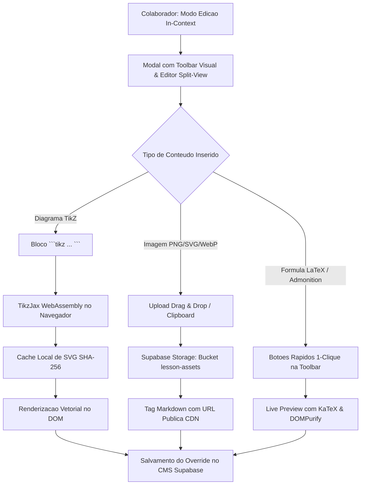

# Proposta Arquitetural: Editor Rico para Colaboradores (TikZ, Imagens & Live Preview)

Este documento especifica a arquitetura técnica, os fluxos de renderização, a integração com WebAssembly e o modelo de persistência para capacitar professores, autores e mentores a editarem aulas no **Brasil Finanças Atlas (BFA)** com suporte nativo a diagramas vetoriais em **TikZ**, upload de imagens (*Drag & Drop*) e barra de ferramentas visual com **Live Preview**.

---

## 1. Visão Geral da Arquitetura

O ecossistema de edição do BFA é baseado no componente in-context [`EditableBlock.jsx`](../src/components/EditableBlock.jsx) e no painel administrativo [`AdminPages.jsx`](../src/pages/AdminPages.jsx). A nova arquitetura evolui esse ambiente para um editor de alta produtividade:



### Objetivos Centrais:
1. **Autonomia de Autoria:** Permitir que docentes criem gráficos de alta precisão (árvores de decisão, fluxogramas de carteiras, eixos cartesianos) diretamente em código LaTeX/TikZ sem softwares externos.
2. **Zero-Latency Preview:** Pré-visualização instantânea lado a lado (Split View) antes de persistir alterações para todos os alunos.
3. **Imutabilidade e Eficiência Vetorial:** Diagramas TikZ geram arquivos SVG puros, que não perdem resolução em telas Retina e consomem menos de 15 KB de banda.
4. **Segurança Rigorosa:** Higienização via `DOMPurify` para impedir vetores de XSS via código SVG malicioso ou injeção de scripts.

---

## 2. Arquitetura 1: Suporte a Diagramas em TikZ no Markdown

### 2.1 Mecanismo de Execução no Navegador (TikzJax WebAssembly)
O TikzJax é uma biblioteca baseada no CoreTeX compilado para WebAssembly que executa uma distribuição mínima do TeX + PGF/TikZ diretamente no navegador do usuário, sem necessidade de servidores backend dedicados.

#### Fluxo de Renderização no `LessonContent.jsx`:
1. O parser detecta o bloco delimitador ````tikz ... ````.
2. Um hash SHA-256 do código TikZ é gerado como chave de identificação.
3. O sistema consulta o cache local (`localStorage` / IndexedDB). Se o SVG correspondente já existir, ele é injetado imediatamente (0 ms de overhead).
4. Se for a primeira execução, o script invoca o Web Worker do TikzJax para compilar o código em segundo plano, evitando travamentos na thread principal do React.
5. O SVG resultante é validado e exibido no container `<div class="bfa-tikz-wrapper">`.

```javascript
// Exemplo de Integracao no LessonContent.jsx
async function renderTikzBlock(tikzCode, containerElement) {
  const hash = await crypto.subtle.digest('SHA-256', new TextEncoder().encode(tikzCode))
    .then(buf => Array.from(new Uint8Array(buf)).map(b => b.toString(16).padStart(2, '0')).join(''));
  
  const cachedSvg = localStorage.getItem(`bfa_tikz_${hash}`);
  if (cachedSvg) {
    containerElement.innerHTML = cachedSvg;
    return;
  }

  if (window.tikzjax) {
    try {
      const svg = await window.tikzjax.process(tikzCode);
      const cleanSvg = window.DOMPurify.sanitize(svg, { USE_PROFILES: { svg: true, svgFilters: true } });
      localStorage.setItem(`bfa_tikz_${hash}`, cleanSvg);
      containerElement.innerHTML = cleanSvg;
    } catch (err) {
      console.warn('Erro na compilacao TikZ:', err);
      containerElement.innerHTML = `<div class="bfa-admonition bfa-admonition--warning"><p>Erro ao compilar TikZ: ${err.message}</p></div>`;
    }
  }
}
```

---

### 2.2 Pipeline de Fallback & Pré-Compilação Local (`dvisvgm`)
Para ambientes de build estático, deploys de produção ou máquinas com baixa capacidade de processamento, é disponibilizado um utilitário CLI local (`scratch/compile_tikz.py`):

```python
# Pipeline CLI: TeX -> DVI -> SVG Vetorial Otimizado
import subprocess
import hashlib

def compile_tikz_to_svg(tikz_code, output_path):
    tex_template = f"""\\documentclass[tikz,border=5pt]{{standalone}}
\\usepackage{{pgfplots}}
\\pgfplotsset{{compat=1.18}}
\\begin{{document}}
{tikz_code}
\\end{{document}}"""
    
    with open("temp.tex", "w", encoding="utf-8") as f:
        f.write(tex_template)
    
    # Compilacao para DVI
    subprocess.run(["latex", "-interaction=nonstopmode", "temp.tex"], check=True)
    # Conversao DVI para SVG Vetorial Puro
    subprocess.run(["dvisvgm", "--no-fonts", "--exact-bbox", "temp.dvi", "-o", output_path], check=True)
```

---

### 2.3 Biblioteca de Templates TikZ para Finanças & Matemática

Os seguintes esqueletos de código serão disponibilizados na Toolbar para inserção em 1 clique:

#### Template A: Linha do Tempo de Fluxo de Caixa (VPL / TIR)
```latex
\begin{tikzpicture}[x=1.5cm, y=1cm, >=stealth]
  % Eixo temporal
  \draw[->, thick, color=blue!80!black] (0,0) -- (5.5,0) node[right] {Tempo ($t$)};
  
  % Marcadores de periodo
  \foreach \x in {0,1,2,3,4,5} {
    \draw (\x, 0.1) -- (\x, -0.1) node[below=2pt] {$t_{\x}$};
  }
  
  % Fluxo Inicial (Investimento)
  \draw[->, very thick, color=red!80!black] (0,0) -- (0,-2) node[below] {$-I_0$ (Aporte)};
  
  % Fluxos Futuros (Entradas de Caixa)
  \draw[->, very thick, color=green!60!black] (1,0) -- (1,1.5) node[above] {$FC_1$};
  \draw[->, very thick, color=green!60!black] (2,0) -- (2,1.8) node[above] {$FC_2$};
  \draw[->, very thick, color=green!60!black] (3,0) -- (3,2.2) node[above] {$FC_3$};
  \draw[->, very thick, color=green!60!black] (4,0) -- (4,2.5) node[above] {$FC_4$};
  \draw[->, very thick, color=green!60!black] (5,0) -- (5,3.0) node[above] {$FC_5 + V_R$};
\end{tikzpicture}
```

#### Template B: Árvore de Decisão de Investimento (Opções & Probabilidades)
```latex
\begin{tikzpicture}[level 1/.style={sibling distance=3.5cm, level distance=2.5cm},
                    level 2/.style={sibling distance=1.8cm, level distance=2.5cm},
                    every node/.style={text centered, font=\small}]
  \node[rectangle, draw=blue!70, fill=blue!10, rounded corners] {Decisao: Ativo A}
    child {
      node[circle, draw=green!70, fill=green!10] {Cenario Alta ($p=0.6$)}
        child { node[rectangle, draw=gray] {Retorno: $+25\%$} }
        child { node[rectangle, draw=gray] {Dividendos: $+5\%$} }
    }
    child {
      node[circle, draw=red!70, fill=red!10] {Cenario Baixa ($p=0.4$)}
        child { node[rectangle, draw=gray] {Retorno: $-10\%$} }
        child { node[rectangle, draw=gray] {Protecao Put: $+8\%$} }
    };
\end{tikzpicture}
```

---

## 3. Arquitetura 2: Upload & Inserção de Imagens (PNG, SVG, WebP)

### 3.1 Captura por Drag & Drop e Área de Transferência
A área de texto do editor in-context escuta eventos nativos de `drop` e `paste`:

```javascript
// Handler no EditableBlock.jsx
const handleImageDrop = async (e) => {
  e.preventDefault();
  const files = Array.from(e.dataTransfer ? e.dataTransfer.files : e.clipboardData.files);
  const imageFile = files.find(f => f.type.startsWith('image/'));
  
  if (!imageFile) return;
  
  // Validacao de Tamanho (Maximo: 2 MB)
  if (imageFile.size > 2 * 1024 * 1024) {
    alert('Erro: A imagem deve ter no maximo 2 MB.');
    return;
  }

  // Upload para Supabase Storage
  const publicUrl = await uploadToSupabaseStorage(imageFile);
  if (publicUrl) {
    const markdownImgTag = `\n\n![${imageFile.name.replace(/\.[^/.]+$/, "")}](${publicUrl})\n\n`;
    insertTextAtCursor(markdownImgTag);
  }
};
```

### 3.2 Estrutura do Bucket no Supabase Storage
- **Bucket:** `lesson-assets` (Público para leitura de alunos, restrito para escrita via RLS).
- **Diretório:** `/public/lessons/[subjectKey]/[lessonSlug]/[timestamp]-[filename].webp`
- **Políticas de Acesso (RLS):**
  - `SELECT`: Liberado para `anon` e `authenticated`.
  - `INSERT` / `UPDATE` / `DELETE`: Restrito a usuários com `auth.jwt() -> role IN ('teacher', 'admin')`.

---

## 4. Arquitetura 3: Barra de Ferramentas Visual & Live Preview

### 4.1 Interface da Toolbar
A barra superior do modal de edição disponibiliza botões de ação imediata:

| Botão | Ação / Sintaxe Injetada | Exemplo de Saída Visual |
| :--- | :--- | :--- |
| `[ + KaTeX $$ ]` | `$$\n\text{Taxa Real} = \frac{1 + i}{1 + \pi} - 1\n$$` | Equação matemática centralizada e renderizada |
| `[ + Caixa Retrátil ]` | `???+ solution "Gabarito Analítico"\nPasso a passo da resolução...` | Detalhe retrátil com ícone SVG expansível |
| `[ + Caixa Destaque ]` | `!!! tip "Dica de Prova"\nConceito chave para a BRHSIC...` | Banner destacado com borda colorida e ícone |
| `[ + Diagrama TikZ ]` | Bloco delimitado com esqueleto `\begin{tikzpicture} ...` | Gráfico vetorial SVG compilado via WebAssembly |
| `[ + Imagem ]` | Dispara modal de seleção de arquivo local ou URL | `` |

---

### 4.2 Editor Split-View (Editor + Pré-Visualização em Tempo Real)
O modal de edição adota layout em duas colunas responsivas:
- **Coluna Esquerda (50%):** `<textarea>` com fonte monospace, suporte a indentação por tecla `Tab` e atalhos de teclado (`Ctrl+B`, `Ctrl+K`, `Ctrl+S`).
- **Coluna Direita (50%):** Painel de Live Preview instantâneo renderizado com o motor do [`LessonContent.jsx`](../src/components/LessonContent.jsx) (KaTeX + Admonitions + SVGs sanitizados).

---

## 5. Cronograma de Implementação (Roadmap)

1. **Etapa 1 (Fase Atual):** Estruturação do documento de especificação e limpeza de rotas não homologadas.
2. **Etapa 2:** Implementação da Toolbar com Live Preview e injeção de Admonitions/KaTeX no [`EditableBlock.jsx`](../src/components/EditableBlock.jsx).
3. **Etapa 3:** Integração do Web Worker TikzJax e cache local de SVGs no [`LessonContent.jsx`](../src/components/LessonContent.jsx).
4. **Etapa 4:** Conexão com o Supabase Storage Bucket para upload com Drag & Drop de arquivos PNG, SVG e WebP.
