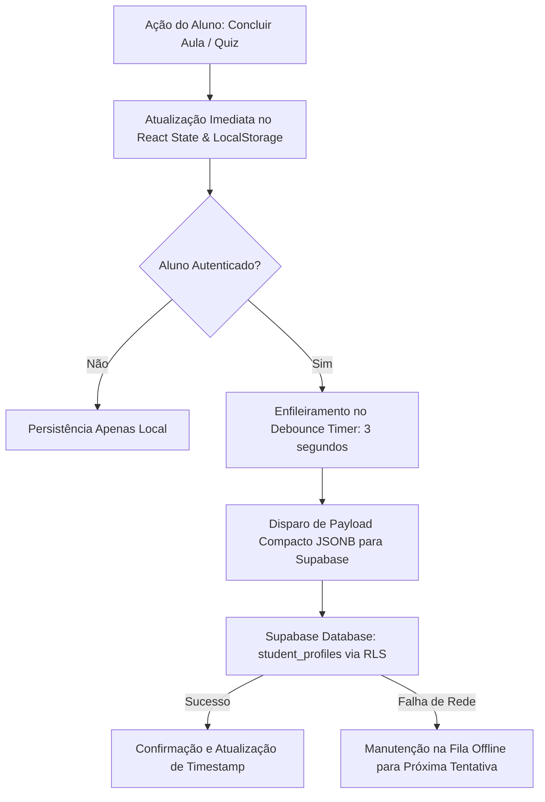
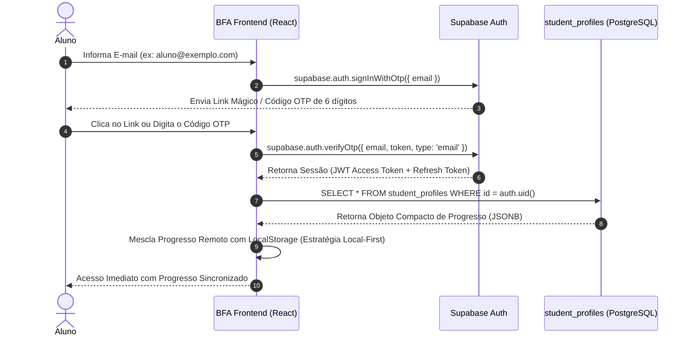

# Arquitetura e Segurança: Login e Sincronização de Alunos (Supabase)

Este documento especifica a arquitetura técnica, a modelagem de dados de baixo consumo de armazenamento (Micro-Storage Footprint), as políticas de segurança (Row Level Security - RLS), as diretrizes de privacidade (LGPD) e a implementação do hook de autenticação e sincronização local-first para o **Brasil Finanças Atlas (BFA)**.

---

## 1. Visão Geral da Arquitetura

O sistema adota uma abordagem **Local-First com Sincronização Assíncrona via Debounce**:



### Princípios Fundamentais:
1. **Micro-Storage Footprint (< 1 KB por Aluno):** Eliminação de tabelas relacionais excessivas (evitando normalização desnecessária para logs de eventos). Todos os dados de progresso das 55 aulas, pontuações de quizzes e insígnias são armazenados em um único documento `JSONB` compacto.
2. **Zero-Latency UI:** As ações do usuário têm resposta de 0 ms na interface, pois a gravação local ocorre de forma síncrona no `localStorage`.
3. **Resiliência a Desconexões:** Se o aluno estiver offline ou a conexão cair, o progresso permanece íntegro no navegador e é sincronizado no próximo login ou reconexão.
4. **Blindagem de Segurança (RLS + OWASP):** O banco de dados bloqueia qualquer acesso não autorizado. Um aluno autenticado só consegue ler e atualizar sua própria linha (`auth.uid() = id`).

---

## 2. Micro-Storage Footprint (Análise de Armazenamento)

### Estimativa de Tamanho por Aluno:
- `id` (UUID): 16 bytes
- `name` (VARCHAR 80): ~25 bytes (média)
- `role` (VARCHAR 15): ~7 bytes
- `streak_days` (SMALLINT): 2 bytes
- `updated_at` (TIMESTAMPTZ): 8 bytes
- `progress` (JSONB compactado):
  - `completed_lessons` (Array de até 55 slugs de 10 bytes): ~550 bytes
  - `quiz_scores` (Objeto com 55 chaves e valores numéricos inteiros): ~150 bytes
  - `badges` (Array de 5 a 10 IDs curtos): ~50 bytes
  - Overhead do cabeçalho JSONB do PostgreSQL: ~30 bytes
- **Total por Estudante:** ~838 bytes (~0,82 KB).

### Capacidade no Plano Gratuito do Supabase (500 MB):
$$\text{Capacidade de Alunos} = \frac{500 \times 1024 \times 1024 \text{ bytes}}{838 \text{ bytes/aluno}} \approx 625.000 \text{ alunos ativos}$$

O BFA pode atender mais de meio milhão de alunos na camada gratuita do Supabase sem necessidade de upgrade de plano.

---

## 3. Schema SQL Pronto para Produção (Supabase SQL Editor)

O script abaixo cria a tabela `student_profiles`, configura o gatilho de criação automática na confirmação de cadastro do Supabase Auth, define os índices otimizados e ativa as políticas restritivas de RLS.

```sql
-- ============================================================================
-- BRASIL FINANÇAS ATLAS (BFA) — SCHEMA DE PERFIS E PROGRESSO DE ALUNOS
-- Executar no SQL Editor do Painel do Supabase
-- ============================================================================

-- 1. Criação da Tabela Única Compacta
CREATE TABLE IF NOT EXISTS public.student_profiles (
    id UUID PRIMARY KEY REFERENCES auth.users(id) ON DELETE CASCADE,
    name VARCHAR(80) NOT NULL DEFAULT 'Estudante',
    role VARCHAR(15) NOT NULL DEFAULT 'student' CHECK (role IN ('student', 'mentor', 'admin')),
    streak_days SMALLINT NOT NULL DEFAULT 0 CHECK (streak_days >= 0),
    progress JSONB NOT NULL DEFAULT '{
        "completed_lessons": [],
        "quiz_scores": {},
        "badges": []
    }'::jsonb,
    created_at TIMESTAMPTZ NOT NULL DEFAULT TIMEZONE('utc'::text, NOW()),
    updated_at TIMESTAMPTZ NOT NULL DEFAULT TIMEZONE('utc'::text, NOW())
);

-- 2. Índice B-Tree para Consultas Rápidas por ID e Role
CREATE INDEX IF NOT EXISTS idx_student_profiles_id ON public.student_profiles(id);
CREATE INDEX IF NOT EXISTS idx_student_profiles_role ON public.student_profiles(role);

-- 3. Função e Gatilho para Atualização Automática de updated_at
CREATE OR REPLACE FUNCTION public.handle_updated_at()
RETURNS TRIGGER AS $$
BEGIN
    NEW.updated_at = TIMEZONE('utc'::text, NOW());
    RETURN NEW;
END;
$$ LANGUAGE plpgsql SECURITY DEFINER;

DROP TRIGGER IF EXISTS set_student_profiles_updated_at ON public.student_profiles;
CREATE TRIGGER set_student_profiles_updated_at
    BEFORE UPDATE ON public.student_profiles
    FOR EACH ROW
    EXECUTE FUNCTION public.handle_updated_at();

-- 4. Função e Gatilho para Criação Automática do Perfil no Cadastro do Auth
CREATE OR REPLACE FUNCTION public.handle_new_student_signup()
RETURNS TRIGGER AS $$
BEGIN
    INSERT INTO public.student_profiles (id, name, role, progress)
    VALUES (
        NEW.id,
        COALESCE(NEW.raw_user_meta_data->>'name', split_part(NEW.email, '@', 1), 'Estudante'),
        'student',
        '{
            "completed_lessons": [],
            "quiz_scores": {},
            "badges": []
        }'::jsonb
    )
    ON CONFLICT (id) DO NOTHING;
    RETURN NEW;
END;
$$ LANGUAGE plpgsql SECURITY DEFINER;

DROP TRIGGER IF EXISTS on_auth_user_created_student ON auth.users;
CREATE TRIGGER on_auth_user_created_student
    AFTER INSERT ON auth.users
    FOR EACH ROW
    EXECUTE FUNCTION public.handle_new_student_signup();

-- ============================================================================
-- POLÍTICAS DE SEGURANÇA (ROW LEVEL SECURITY - RLS)
-- ============================================================================

-- Ativação Obrigatória de RLS
ALTER TABLE public.student_profiles ENABLE ROW LEVEL SECURITY;

-- Política 1: Aluno só pode ler o próprio perfil e progresso
DROP POLICY IF EXISTS "Aluno le proprio perfil" ON public.student_profiles;
CREATE POLICY "Aluno le proprio perfil"
ON public.student_profiles
FOR SELECT
USING (auth.uid() = id);

-- Política 2: Aluno só pode atualizar o próprio perfil e progresso
DROP POLICY IF EXISTS "Aluno atualiza proprio perfil" ON public.student_profiles;
CREATE POLICY "Aluno atualiza proprio perfil"
ON public.student_profiles
FOR UPDATE
USING (auth.uid() = id)
WITH CHECK (auth.uid() = id);

-- Política 3: Inserção controlada (Apenas o próprio usuário ou o trigger do sistema)
DROP POLICY IF EXISTS "Aluno insere proprio perfil" ON public.student_profiles;
CREATE POLICY "Aluno insere proprio perfil"
ON public.student_profiles
FOR INSERT
WITH CHECK (auth.uid() = id);
```

---

## 4. Checklist de Cibersegurança & Conformidade LGPD

### 1. Row Level Security (RLS) Inegociável
- Todas as operações (`SELECT`, `UPDATE`, `INSERT`) na tabela `student_profiles` exigem validação criptográfica via `auth.uid() = id`.
- Nenhum usuário anônimo ou estudante pode visualizar o progresso, notas ou nome de outros estudantes.

### 2. Gestão de Chaves de API e Secrets
- O frontend consome exclusivamente a **`SUPABASE_ANON_KEY`**.
- A chave de administração **`SUPABASE_SERVICE_ROLE_KEY`** está estritamente proibida no código cliente, variáveis de ambiente públicas, repositório Git e bundles de produção.
- Todas as requisições autenticadas enviam o token JWT emitido pelo Supabase Auth no header `Authorization: Bearer <token>`.

### 3. Validação e Sanitização de Payload (OWASP Top 10)
- O campo `progress` recebe validação de formato estruturado antes do envio.
- Slugs de aulas e identificadores são limitados a caracteres alfanuméricos e hífens (`^[a-z0-9\-]+$`).
- As pontuações de quiz são validadas como números inteiros no intervalo permitido (`0` a `100` ou valor máximo do teste).

### 4. Coleta Mínima e LGPD (Lei Geral de Proteção de Dados - Lei 13.709/2018)
- **Princípio da Necessidade:** Coleta exclusiva de E-mail (necessário para autenticação/recuperação de acesso) e Nome/Apelido de exibição.
- **Não Coleta de Dados Sensíveis:** Não são solicitados nem armazenados CPF, RG, telefone, endereço, geolocalização ou dados financeiros reais.
- **Direito de Eliminação:** Caso o usuário solicite exclusão da conta, a regra `ON DELETE CASCADE` no schema do banco remove automaticamente todos os registros de progresso associados.

---

## 5. Fluxo de Autenticação do Aluno

O processo de autenticação foi projetado para ser sem atrito (Passwordless / Magic Link e Código OTP por E-mail):



---

## 6. Hook React de Autenticação e Sincronização (`useStudentAuth.js`)

Abaixo está a implementação completa do hook de sincronização híbrida com debounce de 3 segundos, controle de estado e mesclagem de progresso:

```javascript
/* ==========================================================================
   Brasil Finanças Atlas (BFA) — Hook de Autenticação e Sincronização Local-First
   Arquivo: src/utils/useStudentAuth.js
   ========================================================================== */

const { useState, useEffect, useRef, useCallback } = React;

function useStudentAuth() {
  const [user, setUser] = useState(null);
  const [profile, setProfile] = useState(null);
  const [isLoading, setIsLoading] = useState(true);
  const [isSyncing, setIsSyncing] = useState(false);
  const [syncStatus, setSyncStatus] = useState('idle'); // 'idle' | 'syncing' | 'saved' | 'error'

  const debounceTimerRef = useRef(null);
  const pendingProgressRef = useRef(null);

  // Inicializa e monitora o estado da sessão Supabase
  useEffect(() => {
    let mounted = true;

    async function initSession() {
      try {
        if (!window.BfaSupabase || !window.BfaSupabase.client) {
          setIsLoading(false);
          return;
        }

        const supabase = window.BfaSupabase.client;
        const { data: { session } } = await supabase.auth.getSession();

        if (session && session.user && mounted) {
          setUser(session.user);
          await loadStudentProfile(session.user.id);
        }
      } catch (err) {
        console.warn('[BFA Auth] Erro ao recuperar sessão:', err);
      } finally {
        if (mounted) setIsLoading(false);
      }
    }

    initSession();

    // Listener de mudança de autenticação
    let authListener = null;
    if (window.BfaSupabase && window.BfaSupabase.client) {
      const { data } = window.BfaSupabase.client.auth.onAuthStateChange(async (event, session) => {
        if (!mounted) return;
        if (session && session.user) {
          setUser(session.user);
          await loadStudentProfile(session.user.id);
        } else {
          setUser(null);
          setProfile(null);
        }
      });
      authListener = data?.subscription;
    }

    return () => {
      mounted = false;
      if (authListener) authListener.unsubscribe();
      if (debounceTimerRef.current) clearTimeout(debounceTimerRef.current);
    };
  }, []);

  // Carrega e mescla o perfil do banco com os dados do LocalStorage
  const loadStudentProfile = async (userId) => {
    try {
      const supabase = window.BfaSupabase.client;
      const { data, error } = await supabase
        .from('student_profiles')
        .select('id, name, role, streak_days, progress')
        .eq('id', userId)
        .single();

      if (error && error.code !== 'PGRST116') {
        console.warn('[BFA Auth] Erro ao carregar perfil:', error);
        return;
      }

      if (data) {
        setProfile(data);
        mergeLocalWithRemoteProgress(data.progress);
      }
    } catch (err) {
      console.warn('[BFA Auth] Exceção ao carregar perfil:', err);
    }
  };

  // Mescla dados do LocalStorage com o banco remoto
  const mergeLocalWithRemoteProgress = (remoteProgress) => {
    try {
      const localLessons = JSON.parse(localStorage.getItem('bfa_user_progress') || '[]');
      const localScores = JSON.parse(localStorage.getItem('bfa_quiz_scores') || '{}');

      const remoteLessons = remoteProgress?.completed_lessons || [];
      const remoteScores = remoteProgress?.quiz_scores || {};

      // União de aulas concluídas sem duplicatas
      const mergedLessons = Array.from(new Set([...localLessons, ...remoteLessons]));

      // Mesclagem de pontuações preservando a maior nota
      const mergedScores = { ...remoteScores };
      Object.keys(localScores).forEach((key) => {
        mergedScores[key] = Math.max(mergedScores[key] || 0, localScores[key] || 0);
      });

      // Atualiza LocalStorage
      localStorage.setItem('bfa_user_progress', JSON.stringify(mergedLessons));
      localStorage.setItem('bfa_quiz_scores', JSON.stringify(mergedScores));

      // Dispara evento de sincronização para os contextos React
      window.dispatchEvent(new CustomEvent('bfa_progress_updated', {
        detail: { completedLessons: mergedLessons, quizScores: mergedScores }
      }));
    } catch (e) {
      console.warn('[BFA Auth] Erro na mesclagem de progresso:', e);
    }
  };

  // Envia progresso para o Supabase com Debounce de 3 segundos
  const syncProgressDebounced = useCallback((newCompletedLessons, newQuizScores, newBadges = []) => {
    // 1. Atualização Imediata no LocalStorage
    localStorage.setItem('bfa_user_progress', JSON.stringify(newCompletedLessons));
    localStorage.setItem('bfa_quiz_scores', JSON.stringify(newQuizScores));

    if (!user || !window.BfaSupabase || !window.BfaSupabase.client) {
      return;
    }

    setSyncStatus('syncing');
    pendingProgressRef.current = {
      completed_lessons: newCompletedLessons,
      quiz_scores: newQuizScores,
      badges: newBadges
    };

    if (debounceTimerRef.current) {
      clearTimeout(debounceTimerRef.current);
    }

    debounceTimerRef.current = setTimeout(async () => {
      try {
        setIsSyncing(true);
        const supabase = window.BfaSupabase.client;
        const payload = pendingProgressRef.current;

        const { error } = await supabase
          .from('student_profiles')
          .update({
            progress: payload,
            updated_at: new Date().toISOString()
          })
          .eq('id', user.id);

        if (error) throw error;
        setSyncStatus('saved');
        setTimeout(() => setSyncStatus('idle'), 2500);
      } catch (err) {
        console.error('[BFA Sync] Erro ao sincronizar progresso:', err);
        setSyncStatus('error');
      } finally {
        setIsSyncing(false);
      }
    }, 3000); // 3 segundos de debounce
  }, [user]);

  // Login via Link Mágico / OTP
  const signInWithEmail = async (email, name = '') => {
    if (!window.BfaSupabase || !window.BfaSupabase.client) {
      throw new Error('Supabase não configurado');
    }
    const supabase = window.BfaSupabase.client;
    const { data, error } = await supabase.auth.signInWithOtp({
      email,
      options: {
        data: { name: name || 'Estudante' },
        emailRedirectTo: window.location.origin
      }
    });
    if (error) throw error;
    return data;
  };

  // Verificação de Código OTP
  const verifyOtpCode = async (email, token) => {
    if (!window.BfaSupabase || !window.BfaSupabase.client) {
      throw new Error('Supabase não configurado');
    }
    const supabase = window.BfaSupabase.client;
    const { data, error } = await supabase.auth.verifyOtp({
      email,
      token,
      type: 'email'
    });
    if (error) throw error;
    if (data?.user) {
      setUser(data.user);
      await loadStudentProfile(data.user.id);
    }
    return data;
  };

  // Logout
  const signOut = async () => {
    if (window.BfaSupabase && window.BfaSupabase.client) {
      await window.BfaSupabase.client.auth.signOut();
    }
    setUser(null);
    setProfile(null);
    setSyncStatus('idle');
  };

  return {
    user,
    profile,
    isAuthenticated: !!user,
    isLoading,
    isSyncing,
    syncStatus,
    signInWithEmail,
    verifyOtpCode,
    signOut,
    syncProgressDebounced
  };
}

window.useStudentAuth = useStudentAuth;
```

---

## 7. Próximos Passos de Integração

1. Executar o script SQL no **SQL Editor** do projeto Supabase.
2. Integrar o `useStudentAuth` dentro do `ProgressContext.jsx` para disparar `syncProgressDebounced` automaticamente ao marcar aulas ou concluir quizzes.
3. Adicionar o modal de Login por E-mail/OTP no componente `NavbarFooter.jsx` com suporte a feedback visual do status de sincronização (`syncStatus`).
